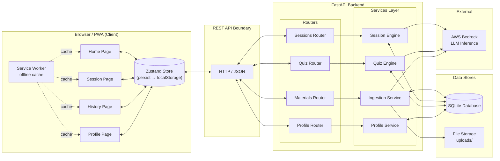
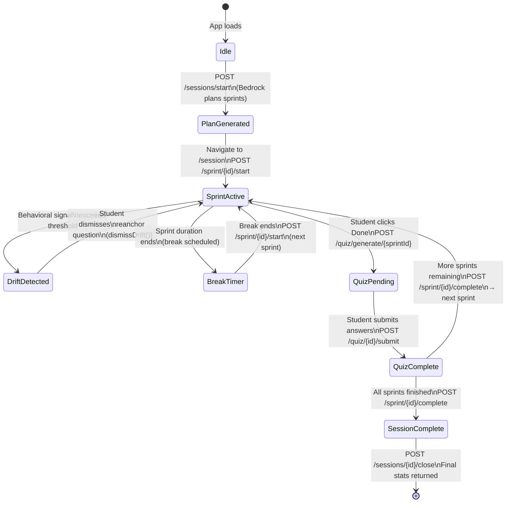
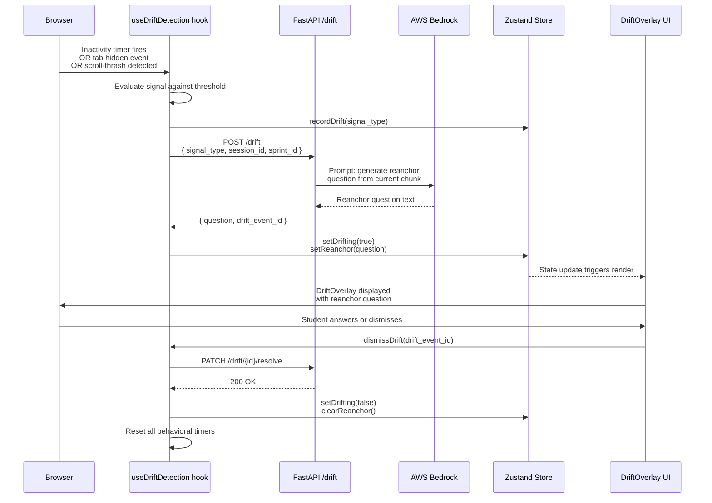
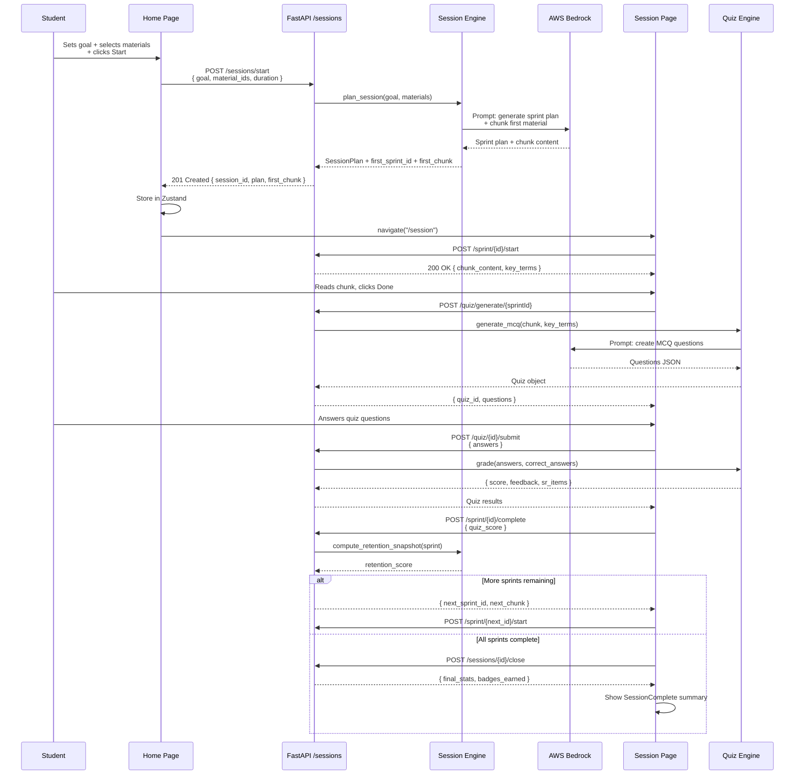
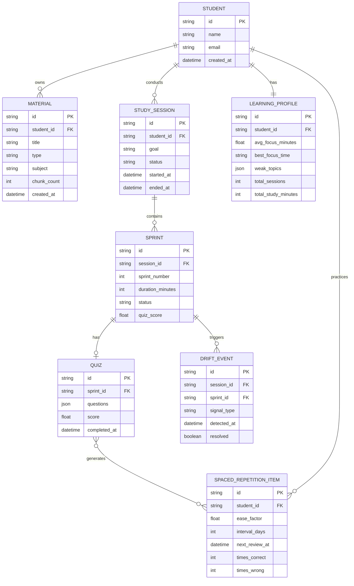

# FocusPilot — Architecture Diagrams

> System design reference for the FocusPilot ADHD Study Companion.

---

## Table of Contents

1. [System Overview](#1-system-overview)
2. [Session Lifecycle State Machine](#2-session-lifecycle-state-machine)
3. [Drift Detection Data Flow](#3-drift-detection-data-flow)
4. [Study Session Data Flow](#4-study-session-data-flow)
5. [Database Entity Relationship Diagram](#5-database-entity-relationship-diagram)
6. [Frontend Component Tree](#6-frontend-component-tree)
7. [Key Design Decisions](#key-design-decisions)

---

## 1. System Overview

Top-level C4-style component diagram showing the full FocusPilot system from client through backend services to external infrastructure.

---

## 2. Session Lifecycle State Machine

All states and transitions of a FocusPilot study session from initialization through completion.

---

## 3. Drift Detection Data Flow

End-to-end sequence from raw behavioral signal in the browser through LLM reanchor generation and overlay rendering.

---

## 4. Study Session Data Flow

Full lifecycle sequence from goal-setting on the Home page through sprint execution, quizzing, and session close.

---

## 5. Database Entity Relationship Diagram

Full relational schema for the FocusPilot SQLite database.

---

## 6. Frontend Component Tree

React component hierarchy from the application root through all page-level and leaf components.

```mermaid
flowchart TB
    App["App.tsx\nuseStudyReminder hook active"]
    App --> Router[BrowserRouter]
    Router --> Layout[Layout]

    Layout --> Home[Home Page]
    Layout --> Session[Session Page]
    Layout --> History[History Page]
    Layout --> Profile[Profile Page]

    Home --> QSC[QuickStartCard]
    Home --> SSF[StudentSetupForm]
    Home --> SC[SubjectCombo]
    Home --> MC["MaterialCard (× N)"]
    Home --> DZ[DropZone]
    Home --> SF[SessionForm]
    SF --> TP[TimePills]
    SF --> MCB[MaterialCheckboxes]
    SF --> RUI[ReminderUI]
    SF --> SB[StartButton]

    Session --> SH[SprintHeader]
    SH --> TM[Timer]
    SH --> PB[ProgressBar]
    Session --> CA[ContentArea]
    CA --> PO[PrimingOverlay]
    CA --> KT[KeyTermsStrip]
    CA --> MDC[MarkdownContent]
    CA --> TB[Toolbar]
    Session --> TP2[TutorPanel]
    TP2 --> ML[MessageList]
    TP2 --> IB[InputBox]
    Session --> OV[Overlays]
    OV --> ECM[EnergyCheckModal]
    OV --> QM[QuizModal]
    OV --> DO[DriftOverlay]
    OV --> BTM[BreakTimerModal]
    OV --> FC[FrustrationCard]
    OV --> FCI[FocusCheckIn]
    OV --> WBB[WelcomeBackBanner]
    OV --> CSM[CheatsheetModal]

    History --> RQB[ReviewQueueBanner]
    History --> SF2[StatusFilters]
    History --> SCd[SessionCard\nexpandable]
    SCd --> RB[RetryButton]
    SCd --> BC[BarChart]
    History --> RM[ReviewModal]

    Profile --> LC[LevelCard]
    Profile --> SG[StatsGrid]
    Profile --> SH2[StudyHeatmap]
    Profile --> CH[Charts]
    CH --> FT[FocusTrend]
    CH --> WT[WeakTopics]
    Profile --> IG[InsightsGrid]
    Profile --> RG[RecommendationsGrid]
    Profile --> AB[AchievementBadges]
    Profile --> WTT[WeakTopicsTags]
```

---

## Key Design Decisions

### 1. SQLite over PostgreSQL

FocusPilot uses SQLite as its primary data store rather than a networked database like PostgreSQL. This choice prioritizes a local-first architecture that eliminates infrastructure cost entirely — there is no database server to provision, maintain, or secure. Because all student data remains on the host machine running the FastAPI backend (typically the student's own laptop or a single-user server), there is zero risk of cloud data leakage. For an application dealing with behavioral attention data for students who may be minors, this is a meaningful privacy guarantee rather than a convenience trade-off.

### 2. AWS Bedrock over Direct OpenAI

All LLM inference is routed through AWS Bedrock rather than calling OpenAI or Anthropic APIs directly. Bedrock provides enterprise-grade security controls, does not retain customer data for model training by default, and operates on HIPAA-eligible infrastructure — a critical consideration for an application that processes behavioral and cognitive performance data. This also provides provider flexibility: the underlying model can be swapped (e.g., Claude, Titan, Llama) without changing application code, and AWS IAM provides fine-grained access control unavailable in direct API key authentication.

### 3. Zustand with `persist` over Redux

Client state is managed with Zustand rather than Redux or React Context. Zustand eliminates the boilerplate of actions, reducers, and selectors while providing the same predictable state container semantics. The `persist` middleware with `partialize` allows precise control over which state slices are written to `localStorage` — for example, persisting the active session plan across page refreshes while excluding ephemeral UI state like overlay visibility. Unlike Context, Zustand subscriptions are selector-based, so components re-render only when the specific slice they consume changes, avoiding the cascade re-renders that context-based state causes in large component trees.

### 4. Sprint-Based Architecture

Sessions are structured as sequences of 15-minute focused sprints rather than open-ended study blocks. This maps directly to the attention window documented in clinical ADHD literature, where sustained voluntary attention degrades significantly beyond 15–20 minutes without an interruption or reward signal. Each sprint ends with a short spaced quiz, which serves a dual purpose: it reinforces working memory encoding before the trace decays (the testing effect), and it provides a behavioral completion signal that resets attentional resources for the next sprint. The sprint model also generates granular per-sprint performance data that feeds the spaced repetition scheduler and learning profile.

### 5. Behavioral Drift Detection over Biometric

Attention drift is detected through three behavioral proxies — prolonged inactivity, tab-hidden events, and scroll-thrash patterns — rather than through camera or microphone access. This design is deliberately camera-free and microphone-free. Biometric attention tracking (eye gaze, facial expression, ambient audio) is more accurate in laboratory conditions but introduces significant privacy risks, requires explicit permissions that many students will deny, and is inaccessible to students with certain disabilities. The three behavioral signals chosen are statistically significant correlates of off-task behavior that can be captured entirely through standard browser event APIs, with no additional hardware, no media permissions, and no data leaving the device during signal collection.
